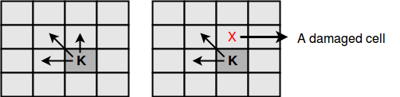
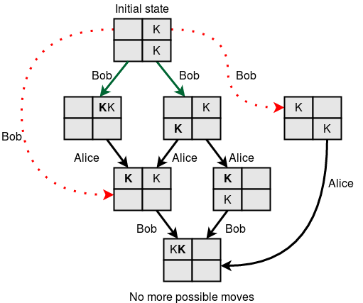

Bob recently invented a new game. The game is played on an  chessboard. The rules of the game are:

Initially, there are kings in some of the cells. A cell can contain more than one king.

A king is only allowed to move in one of three directions: up, left or up-left.

Some of the cells on the board might be damaged. A king is not allowed to move to a damaged cell.

A king cannot be moved outside the board.

There are two players in the game. They make moves alternately.

In a single move, a player must choose a single king and move it to a new cell.

If a player can't make a move, they lose the game.

Bob is playing the game with his friend Alice. Bob always makes the first move. Given the configuration of the board, Find the number of ways Bob can make the first move to ensure that he will win the game, assuming that both players will play optimally.

Input Format

The first line contains , the number of queries. For each query:

The first line contains .
The next  lines each contains  symbols. X means the cell is damaged, K means a cell with a single king and . means an empty cell.
Constraints

.
.
Subtasks

For  of the total score, .
For  of the total score, .
Output Format

For each query, print the answer in a single line: If he can win the game, print WIN X where  is the number of different moves Bob can make. Otherwise, print LOSE.

Sample Input 0  

2 
2 
.K 
.K 
2 
K. 
XX 

Sample Output 0  

WIN 2  
LOSE  

Explanation 0  

Query 1:
Bob will move king from  to  or . Then, the second player will have to move one of the kings in the corner (up-left) and Bob will move the second king to the corner.

Query 2:
In this case, Bob has no move.
