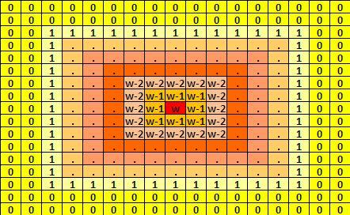
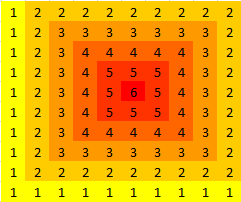
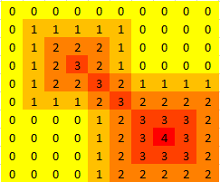

# Eruptin Volcanoes
According to recent research, most active volcanoes are located near the islands of the Pacific Ocean. Scientists know the effects of the volcanic lava and they want to measure the maximum effect of lava on a specific area.

It is difficult for them to analyze the effects on only some islands so they decided to conduct the experiments on an  active volcanic area so that the effects of multiple volcanoes may add up. They know that the lava of a volcano has a lot of effect on the places that it touches.

According to their studies, the lava has a maximum effect in the place of the volcanic eruption, and this effect seems to decrease the further it gets from the eruption place. More specifically, for a volcano located in a cell  with power , first it affects the cell  with power , then it affects yet-unaffected cells adjacent to recently affected cells with power equal to the last power decreased by , and continues this process until the power becomes . Please refer to the below image for the illustration of this process:

Given the size of the study area and the coordinates of the erupting volcanoes, find the maximum total effect value of the lava across all cells in the experiment's area.

Input Format

In the first line, you will be given an integer  which represents the dimension of the square study area. The upper-left corner has the coordinates  and the bottom-right corner has the coordinates . In the next line, you will be given an integer  which represents the number of the active volcanoes in the study area. In the following  lines you will be given three integers, , , and  where  and  are the coordinates of each erupting volcano and  is the power of its lava.

Note:  denotes the row number and  denotes the column number.

Constraints

The locations of the volcanoes need not be distinct.
Output Format

Print a single line containing a single integer denoting the maximum effect of the lava coming from all the volcanoes inside the study area that is being analyzed by the scientists.

Sample Input 0  

10  
1  
4 5 6  

Sample Output 0  

6  

Explanation 0  

Sample Input 1  

10  
2  
3 3 3  
7 7 4  

Sample Output 1  

4  
Explanation 1  

