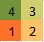

# The Snake vs the Wind

A group of scientists is doing some experiments with a snake. They want to measure its intelligence by observing the way it moves inside a specific area. The scientists have inserted the snake inside a two-dimensional  square. They have filled the area with  mice (one in each small square of the area) in order to motivate the snake to move. The scientists know that the snake is very hungry so the snake will eat all of the mice. In order to make things more difficult for the snake, they will apply a very strong artificial wind blowing towards certain directions (north, south, west or east) that usually disturbs the snake a lot.

The scientists have seen in their previous experiments that the snake hates the wind so much so that it will try to do its best not to move in the opposite direction of the wind because its eyes are very sensitive to the dust. At any instant, the snake (greedily) prefers to move in the same direction as the wind, or if that is not possible, it would not be a problem even moving perpendicularly to the wind. The snake is very hungry so if it can see that the only possible way to eat more is to move in an opposite way to the direction of the wind, it will sacrifice a bit its eyes for its stomach.

The snake can make only one move in a second and it can move only up, down, right or left. Also, it cannot move in a place where it was before since we are dealing with a very long snake. The scientists decided to put the snake in one of the four corners of the area and they want you to give them the movement of the snake for each second of the journey.

Note: For a given wind's direction and the initial position of the snake, there exists only one unique path the snake will take to visit all the cells.

Input Format

In the first line, you will be given an integer  where  represents the length and width of the area in which the snake will move. In the second line, you will be given a single character (n, s, w, or e) which determines the direction towards which the wind blows. In the third line, you will be given the coordinates  of the corner where the snake will start the journey. The upper-left corner has the coordinates  and the lower-right corner has the coordinates .

Constraints

The snake will always start the journey in one of the four corners of the grid. 

Output Format

Print the whole journey of the snake by outputting the time at which the snake is found in each specific part of the area. Have a look at the sample outputs for better understanding.

Sample Input 0  

2  
e  
1 0  

Sample Output 0  

4 3  
1 2  

Explanation 0  

<emsp>

Sample Input 1  

4  
n  
0 0  

Sample Output 1  

1 2 3 4  
8 7 6 5  
9 10 11 12  
16 15 14 13  

Explanation 1  

<emsp>
